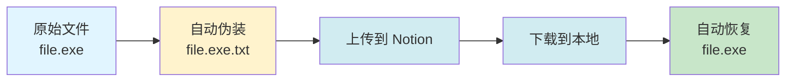

<p align="center">
  
</p>

<h1 align="center">🚀 Notion-Files-Management</h1>

<p align="center">
  <strong>将 Notion 变身为你的无限容量私有云盘</strong><br>
  <em>Transform Notion into your unlimited private cloud storage</em>
</p>

<p align="center">
  <a href="https://opensource.org/licenses/GPL-3.0">
    
  </a>
  <a href="https://www.python.org/downloads/">
    
  </a>
  <a href="https://github.com/RuibinNingh/Notion-Files-Management/releases">
    
  </a>
  <a href="https://github.com/RuibinNingh/Notion-Files-Management">
    
  </a>
  <a href="https://github.com/RuibinNingh/Notion-Files-Management/stargazers">
    
  </a>
</p>

<p align="center">
  <a href="#-项目简介">简介</a> •
  <a href="#-功能特性">特性</a> •
  <a href="#-快速开始">开始使用</a> •
  <a href="#-使用指南">使用指南</a> •
  <a href="#-常见问题">FAQ</a> •
  <a href="#-贡献指南">贡献</a>
</p>

---

## 📖 项目简介

**Notion-Files-Management** 是一款功能强大的命令行工具，突破 Notion 官方客户端限制，将 Notion 页面转换为**无限容量**的私有云存储解决方案。支持大文件上传、多线程下载、智能缓存等企业级特性。

<table>
<tr>
<td width="33%" align="center">
  <br>
  <sub><b>突破单文件限制</b><br>支持 5GB+ 大文件分片上传</sub>
</td>
<td width="33%" align="center">
  <br>
  <sub><b>多层重试机制</b><br>网络不稳定环境稳定工作</sub>
</td>
<td width="33%" align="center">
  <br>
  <sub><b>并发上传下载</b><br>充分利用网络带宽</sub>
</td>
</tr>
</table>

### 🎯 为什么选择我们？

| 特性 | Notion官方 | 本工具 |
|:---:|:---:|:---:|
| **单文件大小限制** | 5MB (免费) / 5GB (付费) | ✅ 无限制 (分片) |
| **批量上传** | ❌ 不支持 | ✅ 目录级批量 |
| **下载加速** | ❌ 单线程 | ✅ Aria2 多线程 |
| **断点续传** | ❌ 不支持 | ✅ 完整支持 |
| **进度监控** | ⚠️ 基础显示 | ✅ Rich UI 实时 |
| **文件格式** | ⚠️ 受限 | ✅ 自动伪装 |

---

## ✨ 功能特性

### 📤 智能上传系统

<details>
<summary><b>🚀 大文件分片引擎</b> - 点击展开详情</summary>

- **自动分片处理**
  - 智能识别文件大小
  - 小文件 (≤20MB): 单次直传
  - 大文件 (>20MB): 10MB 分片上传
  
- **会话管理**
  - 自动创建上传会话
  - 分片级别失效检测
  - 智能会话重建机制
  
- **并发控制**
  ```
  可配置并发数: 1-5 线程
  推荐配置: 2-3 线程 (稳定性 + 速度)
  高速模式: 5 线程 (需要稳定网络)
  ```

- **实时进度监控**
  ```
  [147.5GB 总量] 📂 1/31 ⚡ 3.4MB/s ⏳ 11h33m [░░░░░░░] 3.2%
  ────────────────────────────────────────────────────────
  📤 T1  file1.7z.003 [4.9GB] 🧩 55/990 |▌      | 5% ⚡ 1.9MB/s
  📤 T2  file2.7z.004 [4.9GB] 🧩 50/990 |▌      | 4% ⚡ 2.1MB/s
  🔗 T3  file3.7z.005 [4.9GB] 🧩 990/990 |██████| 100% (挂载中)
  ```

</details>

<details>
<summary><b>🎨 文件格式智能处理</b> - 点击展开详情</summary>

#### 原生支持格式

| 类别 | 格式 |
|------|------|
| 🎵 **音频** | `mp3` `wav` `aac` `m4a` `ogg` `wma` `midi` |
| 🎬 **视频** | `mp4` `avi` `mov` `mkv` `webm` `flv` `wmv` |
| 🖼️ **图片** | `jpg` `png` `gif` `svg` `webp` `heic` `tiff` |
| 📄 **文档** | `pdf` `doc` `docx` `xls` `xlsx` `ppt` `pptx` `txt` |

#### 不支持格式处理



**优势**：
- ✅ 内容完整不变
- ✅ 自动化处理
- ✅ 透明转换

</details>

### 📥 高性能下载系统

<details>
<summary><b>🎯 三引擎下载方案</b> - 点击展开详情</summary>

#### 1️⃣ Python 原生引擎
```python
特点: 稳定可靠、跨平台、无需额外安装
适用: 小批量文件、网络不稳定环境
速度: ⭐⭐⭐
```

#### 2️⃣ Aria2 高速引擎
```bash
特点: 多线程、断点续传、智能分片
适用: 大批量文件、高速网络环境
速度: ⭐⭐⭐⭐⭐
配置: 可调节并发数 (1-5)
```

#### 3️⃣ IDM 专业版
```
特点: 专业下载管理器、最高性能
适用: Windows 用户、极限速度需求
速度: ⭐⭐⭐⭐⭐
格式: 导出 .ef2 文件直接导入 IDM
```

**性能对比**

| 引擎 | 10文件/50GB | 100文件/500GB |
|:----:|:-----------:|:-------------:|
| Python | ~2小时 | ~20小时 |
| Aria2 | ~45分钟 | ~8小时 |
| IDM | ~30分钟 | ~5小时 |

</details>

<details>
<summary><b>🔄 智能缓存系统</b> - 点击展开详情</summary>

- **自动链接管理**
  - 40分钟智能缓存
  - 过期自动刷新
  - 减少 API 请求
  
- **状态监控**
  ```
  缓存状态: ✅ 有效 (还剩 25 分钟)
  文件数量: 156 个文件
  缓存大小: 2.3 GB
  上次更新: 2025-01-10 14:30:25
  ```

- **批量操作优化**
  - 一次性获取所有链接
  - 智能判断是否需要刷新
  - 并发下载加速

</details>

### 🛠️ 文件批处理工具

<details>
<summary><b>📂 智能文件处理</b> - 点击展开详情</summary>

#### 功能列表

1. **批量去除 .txt 后缀**
   ```bash
   处理前: file1.zip.txt, file2.rar.txt
   处理后: file1.zip, file2.rar
   
   特性:
   - 安全检查 (避免覆盖)
   - 批量处理
   - 详细日志
   - 操作确认
   ```

2. **文件列表查看**
   ```
   📂 扫描目录: /path/to/folder
   
   发现 156 个文件:
   ├── 📄 document.pdf (2.3 MB)
   ├── 🎵 music.mp3 (5.1 MB)
   ├── 🖼️ image.jpg (1.2 MB)
   └── ... 还有 153 个文件
   ```

3. **递归文件扫描**
   - 遍历所有子文件夹
   - 智能过滤系统文件
   - 显示相对路径
   - 统计文件信息

</details>

### ⚙️ 系统管理中心

<details>
<summary><b>🔍 状态监控面板</b> - 点击展开详情</summary>

```
┌─────────────── 系统状态 ───────────────┐
│                                         │
│  Aria2 服务:  ✅ 运行中 (端口 6800)     │
│  Python 版本: 3.11.5                    │
│  操作系统:    Windows 11 Pro            │
│  API 版本:    2025-09-03                │
│                                         │
│  ─────── 缓存信息 ───────               │
│  状态: ✅ 有效                          │
│  文件数: 156 个                         │
│  剩余时间: 25 分钟                      │
│                                         │
│  ─────── Notion Token ───────           │
│  状态: ✅ 已配置                        │
│  权限: 读写                             │
│                                         │
└─────────────────────────────────────────┘
```

</details>

---

## 🚀 快速开始

### 📋 环境要求

<table>
<tr>
<td>

**💻 操作系统**
- Windows 10+
- macOS 10.15+
- Ubuntu 18.04+
- 其他 Linux 发行版

</td>
<td>

**🐍 Python 环境**
- Python 3.8+
- pip 20.0+

</td>
<td>

**🌐 网络要求**
- 稳定的互联网连接
- 建议 10Mbps+ 上传
- 支持访问 Notion API

</td>
</tr>
</table>

### 📥 安装方法

<details open>
<summary><b>方法 1: 下载预编译版本 (推荐 Windows 用户)</b></summary>

```bash
# 1. 前往 Releases 页面
https://github.com/RuibinNingh/Notion-Files-Management/releases

# 2. 下载最新版本的压缩包
Notion-Files-Management-v2.0.2-windows.zip

# 3. 解压到任意目录
# 4. 双击运行 main.exe
```

**优点**: 无需配置 Python 环境，开箱即用

</details>

<details>
<summary><b>方法 2: 从源码安装 (所有平台)</b></summary>

```bash
# 1. 克隆仓库
git clone https://github.com/RuibinNingh/Notion-Files-Management.git
cd Notion-Files-Management

# 2. 创建虚拟环境 (可选但推荐)
python -m venv venv

# Windows 激活
venv\Scripts\activate
# Linux/macOS 激活
source venv/bin/activate

# 3. 安装依赖
pip install -r requirements.txt

# 4. 配置环境变量
cp .env.example .env
# 编辑 .env 文件，填入你的 Notion Token

# 5. 运行程序
python main.py
```

</details>

<details>
<summary><b>方法 3: Docker 容器 (高级用户)</b></summary>

```bash
# 1. 构建镜像
docker build -t notion-files-management .

# 2. 运行容器
docker run -it \
  -e NOTION_TOKEN=your_token_here \
  -v $(pwd)/downloads:/app/downloads \
  notion-files-management

# 3. 使用 docker-compose (推荐)
docker-compose up -d
```

</details>

### 🔑 获取 Notion Token

<details>
<summary><b>详细步骤 (点击展开)</b></summary>

#### 1. 创建 Notion Integration

访问 [Notion Developers](https://developers.notion.com) 并登录


#### 2. 配置 Integration

```yaml
名称: Notion Files Management
类型: Internal Integration
权限:
  - Read content
  - Update content
  - Insert content
```

#### 3. 复制 Token

创建完成后，复制 **Internal Integration Token**

```
格式: secret_xxxxxxxxxxxxxxxxxxxxxxxxxxxxxx
```

#### 4. 分享页面给 Integration

1. 打开你要使用的 Notion 页面
2. 点击右上角 **Share**
3. 选择 **Invite**
4. 搜索并添加你刚创建的 Integration
5. 授予 **Can edit** 权限

#### 5. 配置到项目

```bash
# 在项目目录创建 .env 文件
echo "NOTION_TOKEN=your_token_here" > .env
```

</details>

### 🎮 第一次使用

```bash
# 启动程序
python main.py

# 主界面选项
🚀 Notion-Files-Management v2.0.2
────────────────────────────────────
📥 下载文件
📤 上传文件
🛠️ 文件处理
⚙️ 设置检测
🔄 检查更新
🚪 退出

# 按数字键或方向键选择
```

---

## 📚 使用指南

### 📤 上传文件

<details>
<summary><b>单文件上传流程</b></summary>

```bash
1. 选择 "📤 上传文件"
2. 选择 "📄 单个文件"
3. 输入文件路径
   示例: C:\Users\YourName\Documents\file.zip
4. 确认上传
5. 选择并发数 (推荐: 2-3)
6. 等待完成

提示：
- 支持拖拽文件到终端获取路径
- 使用相对路径或绝对路径均可
- 大文件会自动分片，无需担心
```

</details>

<details>
<summary><b>文件夹批量上传</b></summary>

```bash
1. 选择 "📤 上传文件"
2. 选择 "📁 整个文件夹"
3. 输入文件夹路径
   示例: C:\Users\YourName\Downloads\MyFiles
4. 程序会递归扫描所有文件
5. 显示文件列表和总大小
6. 确认后开始批量上传

特点：
✅ 保持目录结构
✅ 自动跳过系统文件
✅ 支持暂停/恢复
✅ 失败文件自动重试
```

</details>

### 📥 下载文件

<details>
<summary><b>使用 Aria2 高速下载 (推荐)</b></summary>

```bash
1. 选择 "📥 下载文件"
2. 输入 Notion 页面 ID
3. 选择 "⚡ Aria2 下载"
4. 选择要下载的文件 (支持多选)
5. 设置保存目录
6. 选择并发数 (推荐: 3-5)
7. Aria2 自动启动
8. 打开 AriaNG 网页界面监控进度
9. 完成后输入 'stop' 关闭服务器

提示：
- 首次使用需要安装 Aria2
- 支持断点续传
- 可在 AriaNG 中暂停/恢复任务
- 默认端口: 6800
```

</details>

<details>
<summary><b>使用 Python 原生下载</b></summary>

```bash
1. 选择 "📥 下载文件"
2. 输入 Notion 页面 ID
3. 选择 "🐍 Python 下载"
4. 选择下载模式:
   - 全部下载: 一键下载所有文件
   - 选择下载: 交互式选择文件
5. 等待下载完成

适用场景：
- 无法安装 Aria2
- 少量文件下载
- 网络不稳定环境
```

</details>

<details>
<summary><b>导出到 IDM</b></summary>

```bash
1. 选择 "📥 下载文件"
2. 输入 Notion 页面 ID
3. 选择 "📋 导出 IDM 任务"
4. 选择要下载的文件
5. 程序生成 .ef2 文件
6. 在 IDM 中导入该文件

优势：
✅ 最高下载速度
✅ IDM 专业管理
✅ 支持队列调度
```

</details>

### 🛠️ 文件处理

<details>
<summary><b>批量去除 .txt 后缀</b></summary>

```bash
使用场景：
从 Notion 下载的伪装文件需要恢复原始格式

操作步骤：
1. 选择 "🛠️ 文件处理"
2. 输入文件夹路径
3. 选择 "🗑️ 去除.txt后缀"
4. 查看找到的 .txt 文件列表
5. 确认处理
6. 等待完成

示例：
处理前:
├── file1.zip.txt
├── file2.rar.txt
└── file3.exe.txt

处理后:
├── file1.zip
├── file2.rar
└── file3.exe

安全特性：
✅ 目标文件存在时跳过
✅ 详细处理日志
✅ 操作前确认
```

</details>

---

## 🔧 高级配置

### ⚡ 性能调优

<details>
<summary><b>上传并发优化</b></summary>

```python
# 编辑 main.py
# 根据网络情况调整

网络带宽    推荐并发
─────────────────────
< 10Mbps    1-2 线程
10-50Mbps   2-3 线程
50-100Mbps  3-4 线程
> 100Mbps   4-5 线程

# 注意：并发越高，对网络稳定性要求越高
```

</details>

<details>
<summary><b>Aria2 高级配置</b></summary>

```bash
# 创建 aria2.conf 文件
# 放置在项目根目录

# 最大同时下载数
max-concurrent-downloads=5

# 单文件最大连接数
max-connection-per-server=16

# 分片大小
min-split-size=10M

# 磁盘缓存
disk-cache=64M

# 文件预分配
file-allocation=none

# 断点续传
continue=true

# 重试次数
max-tries=5
retry-wait=10
```

</details>

<details>
<summary><b>使用代理加速</b></summary>

```bash
# 方法 1: 设置系统代理
export HTTP_PROXY=http://127.0.0.1:7890
export HTTPS_PROXY=http://127.0.0.1:7890

# 方法 2: 使用 Notion API 镜像
# 在 .env 文件中添加
NOTION_URL=http://your-proxy-domain.com

# 方法 3: Aria2 代理配置
# 在 aria2.conf 中添加
all-proxy=http://127.0.0.1:7890
```

</details>

### 🔐 安全配置

<details>
<summary><b>Token 安全管理</b></summary>

```bash
# ❌ 不要这样做
NOTION_TOKEN=secret_123456  # 直接写在脚本中

# ✅ 推荐做法
# 1. 使用环境变量
export NOTION_TOKEN=secret_xxx

# 2. 使用 .env 文件 (已加入 .gitignore)
echo "NOTION_TOKEN=secret_xxx" > .env

# 3. 使用密钥管理工具
# - Windows: Credential Manager
# - macOS: Keychain
# - Linux: Secret Service
```

</details>

---

## ❓ 常见问题

<details>
<summary><b>🔌 网络连接问题</b></summary>

**Q: 出现 `ConnectionResetError` 怎么办？**

A: 这通常是网络不稳定导致的，解决方案：

1. **检查网络连接**
   ```bash
   # 测试与 Notion API 的连接
   ping api.notion.com
   ```

2. **降低并发数**
   ```
   从 5 线程 → 2-3 线程
   ```

3. **使用代理**
   ```bash
   export HTTPS_PROXY=http://127.0.0.1:7890
   ```

4. **增加重试次数**
   ```python
   # 编辑 notion.py
   MAX_RETRIES = 10  # 默认 5
   ```

---

**Q: 上传速度很慢怎么办？**

A: 可能的原因和解决方案：

| 原因 | 解决方案 |
|------|----------|
| 网络带宽不足 | 升级网络套餐或使用 5G 网络 |
| API 限流 | 降低并发数，增加请求间隔 |
| 地理位置远 | 使用 CDN 或代理服务器 |
| 文件过于分散 | 打包后再上传 |

</details>

<details>
<summary><b>📁 文件格式问题</b></summary>

**Q: 某些文件无法上传？**

A: Notion 对文件类型有限制，但本工具已做处理：

```
不支持的文件类型会自动添加 .txt 后缀
下载时自动恢复原始格式
文件内容完全不受影响
```

支持的格式请查看 [文件格式列表](#📁-支持上传的文件类型)

---

**Q: 上传后文件名变了？**

A: 自动处理特殊字符，保证兼容性：

```python
处理规则:
- 移除非法字符: \ / : * ? " < > |
- 截断过长文件名 (>200字符)
- 空格替换为下划线 (可选)
```

如需保留原始文件名，请联系开发者

</details>

<details>
<summary><b>⚙️ 配置和安装问题</b></summary>

**Q: 如何获取 Notion Token？**

A: 详细步骤请参考 [获取 Notion Token](#🔑-获取-notion-token)

---

**Q: Aria2 无法启动？**

A: 检查清单：

- [ ] Aria2 已安装
  ```bash
  # Windows: 下载 aria2c.exe 到项目目录
  # Linux: sudo apt install aria2
  # macOS: brew install aria2
  ```

- [ ] 端口 6800 未被占用
  ```bash
  # Windows
  netstat -ano | findstr 6800
  
  # Linux/macOS
  lsof -i :6800
  ```

- [ ] 防火墙未拦截
  ```bash
  # 添加防火墙规则
  sudo ufw allow 6800/tcp
  ```

---

**Q: Python 依赖安装失败？**

A: 常见解决方案：

```bash
# 1. 升级 pip
python -m pip install --upgrade pip

# 2. 使用国内镜像
pip install -r requirements.txt -i https://pypi.tuna.tsinghua.edu.cn/simple

# 3. 单独安装失败的包
pip install requests --upgrade

# 4. 清除缓存重试
pip cache purge
pip install -r requirements.txt
```

</details>

<details>
<summary><b>🐛 错误代码说明</b></summary>

| 错误代码 | 含义 | 解决方案 |
|:--------:|------|----------|
| `401` | Token 无效或过期 | 重新获取 Token |
| `403` | 权限不足 | 检查 Integration 权限 |
| `404` | 页面不存在 | 确认页面 ID 正确 |
| `429` | 请求过于频繁 | 降低并发数，等待后重试 |
| `500` | Notion 服务器错误 | 等待 Notion 恢复 |
| `503` | 服务不可用 | 检查网络连接 |

</details>

---

## 🤝 贡献指南

### 🎓 关于开发团队

> **特别声明**: 本项目由初中生开发者在学习过程中制作，是我们的第一次项目实践。项目使用了 AI 辅助生成技术。

我们**非常欢迎**社区贡献！虽然我们可能没有太多时间处理所有 issues，但您的每一个贡献都对项目发展至关重要。

### 📝 如何贡献

<details>
<summary><b>报告 Bug</b></summary>

在 [Issues](https://github.com/RuibinNingh/Notion-Files-Management/issues) 页面创建新 issue，包含：

```markdown
**环境信息**
- 操作系统: [例如 Windows 11]
- Python 版本: [例如 3.11.5]
- 项目版本: [例如 v2.0.2]

**问题描述**
简洁清晰地描述问题

**复现步骤**
1. 执行 '...'
2. 点击 '...'
3. 看到错误

**期望行为**
描述你期望发生什么

**截图**
如果适用，添加截图帮助解释问题

**错误日志**
```
粘贴相关错误日志
```
```

</details>

<details>
<summary><b>提交功能建议</b></summary>

我们欢迎任何改进建议！请在 Issues 中：

1. 清楚描述想要的功能
2. 解释为什么这个功能有用
3. 如果可能，提供实现思路

</details>

<details>
<summary><b>贡献代码</b></summary>

```bash
# 1. Fork 本仓库

# 2. 克隆你的 fork
git clone https://github.com/YOUR_USERNAME/Notion-Files-Management.git

# 3. 创建特性分支
git checkout -b feature/amazing-feature

# 4. 提交更改
git commit -m 'Add some amazing feature'

# 5. 推送到分支
git push origin feature/amazing-feature

# 6. 创建 Pull Request
```

**代码规范**：
- 遵循 PEP 8 风格指南
- 添加必要的注释
- 更新相关文档
- 确保所有测试通过

</details>

<details>
<summary><b>改进文档</b></summary>

文档同样重要！您可以：

- 修正拼写/语法错误
- 改进说明的清晰度
- 添加使用示例
- 翻译文档到其他语言

</details>

### 🏆 贡献者名单

感谢所有为项目做出贡献的人！

<!-- 这里可以添加贡献者头像墙 -->
<a href="https://github.com/RuibinNingh/Notion-Files-Management/graphs/contributors">
  
</a>

---

## ⚠️ 免责声明

<details>
<summary><b>📜 重要提醒 - 请务必阅读</b></summary>

### 🔍 项目性质

本项目由**初中生开发者**在学习过程中制作，仅作为**技术学习和研究用途**。项目使用了 AI 辅助生成技术，代码质量和稳定性可能存在不确定性。

### ⚠️ 使用风险

| 风险类型 | 说明 |
|---------|------|
| **数据安全** | 上传到 Notion 的文件受 Notion 服务条款约束 |
| **服务可用性** | Notion 可能更改 API，导致功能失效 |
| **法律合规** | 请确保使用行为符合当地法律法规 |
| **技术风险** | 大文件传输可能因网络问题导致数据丢失或损坏 |

### 🚫 责任限制

<p align="center">
  <strong>⚠️ 开发者不承担任何法律责任 ⚠️</strong>
</p>

1. **免责条款**
   - 对于使用本项目造成的数据丢失、隐私泄露、服务中断等**任何后果**，开发者不承担任何法律责任

2. **使用风险自负**
   - 用户应自行评估使用风险
   - 开发者不对使用后果承担责任

3. **技术支持限制**
   - 本项目为学习项目
   - 开发者可能无法提供及时的技术支持或更新

4. **功能不保证**
   - 项目功能可能存在 bug 或不完整的情况
   - 开发者不提供任何质量保证

### 💡 使用建议

```diff
+ ✅ 备份重要数据 - 在上传前务必备份
+ ✅ 小规模测试 - 先在小文件上测试功能
+ ✅ 遵守服务条款 - 遵守 Notion 和相关服务的条款
+ ✅ 自行承担风险 - 任何使用行为产生的后果由用户自行承担
```

---

**⚖️ 通过使用本项目，您即表示同意以上免责条款。如不同意，请勿使用本项目。**

</details>

---

## 📄 开源许可

<p align="center">
  
</p>

本项目采用 **[GNU General Public License v3.0](LICENSE)** 开源许可证。

```
Copyright (C) 2025 Ruibin_Ningh & Zyx_2012

This program is free software: you can redistribute it and/or modify
it under the terms of the GNU General Public License as published by
the Free Software Foundation, either version 3 of the License, or
(at your option) any later version.

This program is distributed in the hope that it will be useful,
but WITHOUT ANY WARRANTY; without even the implied warranty of
MERCHANTABILITY or FITNESS FOR A PARTICULAR PURPOSE.  See the
GNU General Public License for more details.

You should have received a copy of the GNU General Public License
along with this program.  If not, see <https://www.gnu.org/licenses/>.
```

### 📧 联系方式

- **Email**: ruibinningh@outlook.com
- **GitHub**: [@RuibinNingh](https://github.com/RuibinNingh)
- **Project**: [Notion-Files-Management](https://github.com/RuibinNingh/Notion-Files-Management)

---

## 🙏 致谢

<table>
<tr>
<td align="center" width="33%">
  <br>
  <b>Notion</b><br>
  <sub>提供优秀的 API</sub>
</td>
<td align="center" width="33%">
  <br>
  <b>Aria2</b><br>
  <sub>高性能下载引擎</sub>
</td>
<td align="center" width="33%">
  <br>
  <b>Python</b><br>
  <sub>强大的编程语言</sub>
</td>
</tr>
</table>

### 🔧 使用的开源项目

- [requests](https://github.com/psf/requests) - HTTP 请求库
- [rich](https://github.com/Textualize/rich) - 终端美化库
- [questionary](https://github.com/tmbo/questionary) - 交互式命令行工具
- [python-dotenv](https://github.com/theskumar/python-dotenv) - 环境变量管理
- [packaging](https://github.com/pypa/packaging) - 版本管理工具

### 🌟 特别感谢

- 所有为项目提供反馈和建议的用户
- 开源社区的支持和帮助
- AI 技术使我们能够完成这个项目

---

## 📊 项目统计

<p align="center">
  
</p>

### ⭐ Star History

<p align="center">
  <a href="https://star-history.com/#RuibinNingh/Notion-Files-Management&Date">
    
  </a>
</p>

---

<p align="center">
  <strong>⭐ 如果这个项目对你有帮助，请给我们一个 Star！⭐</strong><br>
  <sub>您的支持是我们最大的动力</sub>
</p>

<p align="center">
  Made with ❤️ by <a href="https://github.com/RuibinNingh">Ruibin_Ningh</a> & <a href="https://github.com/Zyx_2012">Zyx_2012</a>
</p>

<p align="center">
  <sub>🎓 初中生的第一个开源项目</sub>
</p>